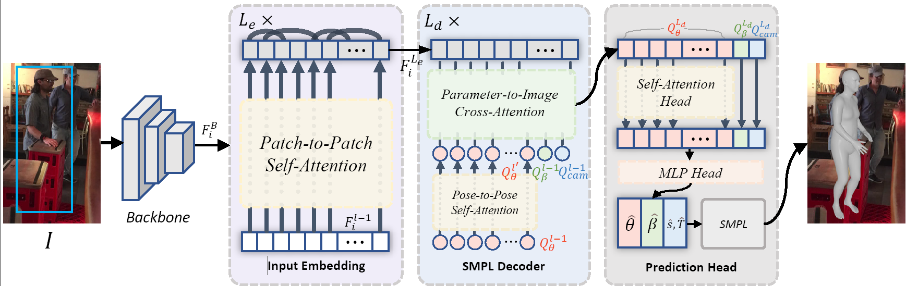

# SimHMR (ACM MM'2023)

Official code repository for the paper:  
[**SimHMR: A Simple Query-based Framework for Parameterized Human Mesh Reconstruction**](#)  
[Zihao Huang*, Min Shi*, Chengxin Liu, Ke Xian, Zhiguo Cao] 
*Equal Contribution

### Abstract
    Human Mesh Reconstruction (HMR) aims to recover 3D human poses and shapes from a single image. Existing parameterized HMR approaches follow the "representation-to-reasoning" paradigm to predict human body and pose parameters. This paradigm typically involves intermediate representation and complex pipeline, where potential side effects may occur that could hinder performance. In contrast, query-based non-parameterized methods directly output 3D joints and mesh vertices, but they rely on excessive queries for prediction, leading to low efficiency and robustness. In this work, we propose a simple query-based framework, dubbed SimHMR, for parameterized human mesh reconstruction. This framework streamlines the prediction process by using a few parameterized queries, which effectively removes the need for hand-crafted intermediate representation and reasoning pipeline. Different from query-based non-parameterized HMR that uses excessive coordinate queries, SimHMR only requires a few semantic queries, which physically correspond to pose, shape, and camera. The use of semantic queries significantly improves the efficiency and robustness in extreme scenarios, e.g., occlusions. Without bells and whistles, SimHMR achieves state-of-the-art performance on 3DPW and Human3.6M benchmarks, and surpasses existing methods on challenging 3DPW-OCC. Code available at github.com/inso-13/SimHMR




## Citation
```bibtex
@inproceedings{huang2023simhmr,
  title={SimHMR: A Simple Query-based Framework for Parameterized Human Mesh Reconstruction},
  author={Huang, Zihao and Shi, Min and Liu, Chengxin and Xian, Ke and Cao, Zhiguo},
  booktitle={Proceedings of the ACM International Conference on Multimedia},
  pages={},
  year={2023}
}
```